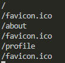
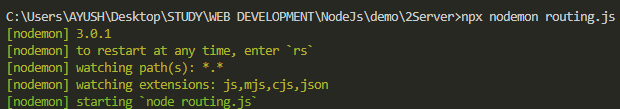

# ROUTING
```js
const http = require('http')

const server = http.createServer((req, res)=>{
    //this will console log '\' in terminal
    console.log(req.url);

    res.end('Hello Server')
})

server.listen(3000)
```
---
The URL i.e. being requested will appear here



---

Let's make some changes

```js
const server = http.createServer((req, res)=>{
    if(req.url=="/about")
        req.end("I am about page")    
    if(req.url=="/profile")
        req.end("I am profile page")
})
```
---
## Auto Reloading
with node fileName.js, it doesn't show changes, we have to restart the server instead use

`nodemon fileName.js`

This will auto reload server on changes
